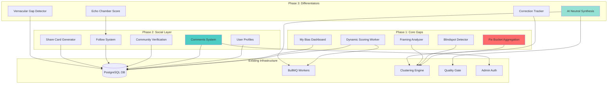

# Design Document: Ground News Parity + Social Layer + Differentiators

## Overview

This feature implements three major capability expansions for The Lens Dispatch platform: achieving feature parity with Ground News' core bias transparency mechanics (Phase 1), adding a privacy-first social layer with community verification (Phase 2), and introducing proprietary differentiators including AI-neutral synthesis and echo chamber scoring (Phase 3). The platform already has a working 4-bucket bias taxonomy (`pro_establishment`, `pro_opposition`, `regional_aligned`, `neutral`) adapted for the Indian media landscape, replacing the traditional US left/center/right model.

The design addresses critical gaps identified in the audit: broken bucket aggregation logic, inconsistent AI summary generation, missing comments infrastructure despite frontend rendering, and US-centric content sourcing that contradicts the platform's India focus. All new features integrate with existing components including the clustering engine (`server/processing.ts`), quality gate (`server/quality-gate.ts`), and authenticated admin routes.

**Key Constraints:**
- No fake/placeholder data in production code
- All 🟡 clarifications must be resolved before implementation
- Maintain existing design system: Playfair Display + DM Sans, shadcn "new-york" style, framer-motion animations
- Preserve mobile breakpoints and accessibility (focus-visible states)
- 4-bucket field names already exist on cluster payloads (field structure correct, aggregation logic broken)

## Architecture



### System Flow: Story Cluster with Social Layer

```mermaid
sequenceDiagram
    participant User
    participant Frontend
    participant API
    participant DB
    participant Worker
    participant AI
    
    User->>Frontend: View Article Detail
    Frontend->>API: GET /api/articles/:id/full
    API->>DB: Fetch article + cluster
    API->>DB: Fetch bucket counts
    Note over API,DB: FIX: Aggregation logic corrected
    DB-->>API: Article + corrected bias distribution
    API->>DB: Fetch comments for cluster
    DB-->>API: Comments + votes
    API-->>Frontend: Full pack with social data
    
    User->>Frontend: Post comment
    Frontend->>API: POST /api/comments
    API->>DB: Rate limit check
    API->>DB: Profanity filter
    API->>DB: Insert comment
    DB-->>API: Comment ID
    API-->>Frontend: Success
    
    User->>Frontend: Vote on bias tag
    Frontend->>API: POST /api/community-ratings
    API->>DB: Record vote
    API->>DB: Check dissent threshold
    alt >40% dissent
        API->>Worker: Queue review job
    end
    DB-->>API: Vote recorded
    API-->>Frontend: Updated consensus
    
    Worker->>DB: Poll for scoring jobs
    Worker->>DB: Fetch publisher article history (30d)
    Worker->>AI: Calculate sensationalism scores
    Worker->>DB: Update dynamic scores
    Worker-->>API: Scores refreshed
