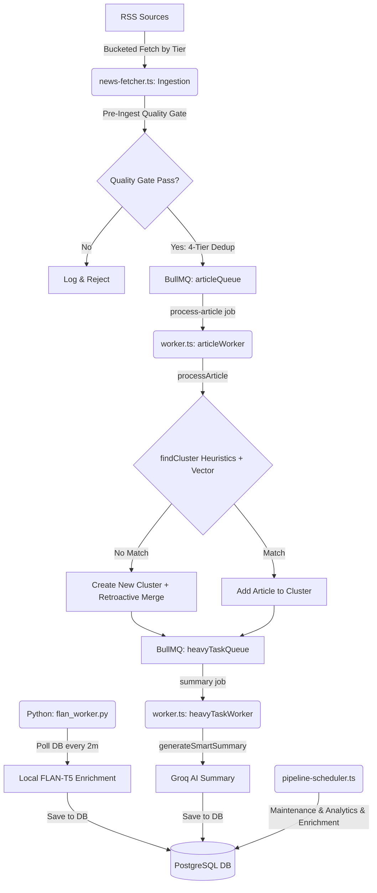

# Modern News Aggregator Platform: Pipeline Architecture Audit & Resolution Report

**Prepared by:** Senior System Architect  
**Scope:** Full end-to-end audit and post-resolution status of the news ingestion, deduplication, clustering, scoring, and AI enrichment pipeline.  
**Audit Date:** May 23, 2026  
**Status:** Ingestion pipeline optimized, AI summarization safe-guarded, orphaned scrapers activated, and compiler integrity fully restored.

---

## SECTION 1 — Full Pipeline Map



The system is composed of hybrid TypeScript (Node.js/BullMQ/Express) and Python processes orchestrated to ingest, cluster, and enrich news content. Below is the detailed mapping of every worker in the pipeline:

### 1. Ingestion & Pre-Ingestion Worker (`news-fetcher.ts`)
* **Trigger:** Adaptive interval scheduler (`startAutoFetch()`). Runs every **5 minutes** during peak hours, **15 minutes** during standard hours, and **60 minutes** at night.
* **Inputs:** Live RSS Feeds defined in `RSS_SOURCES` partitioned by quality/bias buckets (`AGGREGATORS`, `center`, `left`, `right`, `far_left`, `far_right`).
* **Step-by-Step Internal Logic:**
  1. Iterates through the bias buckets in **quality-first order** (Aggregators first to seed trusted wire sources, then center, left/right, and finally far-left/far-right).
  2. Respects a polite fetch cooldown based on publisher tier (15 minutes for Tier-1, 30 minutes for Tier-2, 60 minutes for Tier-3).
  3. Uses **Conditional GET** (HTTP ETags and `If-Modified-Since` headers) to reduce server load.
  4. Applies a `preIngestQualityGate()` check to reject clickbait, non-news (e.g. horoscopes, quizzes), and stale items (>24h).
  5. Performs a **4-tier deduplication check**:
     * **Tier 1:** In-memory URL Hash Set (`PROCESSED_URL_HASHES`)
     * **Tier 2:** In-memory Title Shingles (`domain:title` string)
     * **Tier 3:** Direct DB query index lookup by URL
     * **Tier 4:** E5 Semantic Similarity check via `isDuplicate()` (Jina AI API call checking if cosine similarity > 0.85).
  6. Enqueues accepted articles to BullMQ.
* **Outputs:** 
  * Enqueues `process-article` jobs in `articleQueue` (concurrency 8).
  * Schedules a singleton `"heavy-algo"` job in `heavyTaskQueue` (delayed by 1 minute).
  * Clears the `homepage_clusters_final` cache key.
* **External Services:** Live HTTP RSS servers, Jina AI Embeddings API (`api.jina.ai`).
* **Concurrency:** Runs sequentially by bucket tier, but processes publishers within a tier in concurrent chunks of 5 (using an 800ms stagger timeout).

### 2. Article Processor Worker (`server/worker.ts` - `articleWorker`)
* **Trigger:** BullMQ Event (triggered immediately when a job is added to the `article-processing` queue).
* **Inputs:** A BullMQ job containing: `article` (metadata only), `catMap` (slug to ID mapping), and `systemUserId`.
* **Step-by-Step Internal Logic:**
  1. MD5 hashes the URL and checks PostgreSQL to prevent duplicate processing.
  2. Applies a **7-Day Freshness Filter** (discards articles published >7 days ago).
  3. Detects if the article is a retraction or correction using regex patterns; if so, flags the related cluster as containing a correction and discards the correction article itself.
  4. Obtains a **Jina AI vector embedding** for the article (calls Jina API if not already embedded, then persists it in `article_embeddings`).
  5. Calls `findCluster()` to identify an existing cluster:
     * Fast-filters clusters in the in-memory `clusterKeywordIndex` sharing at least 1 keyword, 1 entity, or 2 title words.
     * Computes a composite story match score (entities * 0.35 + keywords * 0.40 + fingerprints * 0.25 + shingle * 0.15 + containment bonus).
     * If below threshold (0.15), falls back to **Cosine Similarity** (compares Jina vectors; matches if similarity >= 0.75).
  6. If no match is found, creates a new cluster and triggers `retroactivelyMergeToCluster()` (searches the past 7 days of DB articles to find solo articles that fit this new cluster, fetching their full text).
  7. If matched, updates the article with the cluster ID.
  8. Evaluates individual article quality (`computeArticleQuality`) based on clickbait patterns (-25), word count, and publisher factuality, and sets `visibility_state` (`visible`, `low_priority`, `hidden`).
  9. Asynchronously spawns the Python Jina embedding task via a non-blocking promise (`embeddingService.embedArticle`).
  10. Triggers `updateClusterImportance()` to update the cluster's counts, metrics, and velocity.
* **Outputs:** Writes a new article to `articles`, updates `clusters`, and schedules a `"summary"` job in `heavyTaskQueue` (delayed by 1 minute).
* **External Services:** Jina AI Embeddings API.
* **Concurrency:** Parallel execution (8 concurrent BullMQ threads).

### 3. Heavy Tasks Worker (`server/worker.ts` - `heavyTaskWorker`)
* **Trigger:** BullMQ Event (`summary` or `heavy-algo` jobs in the `heavy-tasks` queue).
* **Inputs:** Job data specifying the type (`"summary"` or `"heavy-algo"`) and `clusterId`.
* **Step-by-Step Internal Logic:**
  * **For `"summary"` jobs:**
    1. Triggers `generateSmartSummary(clusterId)`.
    2. Respects an **Efficiency Guard**: skips Groq AI summarization if the cluster has already been summarized and the source count hasn't grown by at least 1.5x (or if it already has a FLAN-enriched summary).
    3. Fetches all articles in the cluster, formats them, and calls the **Groq API** (`summarizeClusterWithGroq`).
    4. Writes a clean paragraph `summary` and 3-bullet list `aiSummary` back to the cluster.
    5. Recalculates the cluster importance score (`updateClusterImportance`).
  * **For `"heavy-algo"` jobs:**
    1. Pulls up to 5,000 published articles and extracts all unique active `clusterId`s.
    2. Batches clusters in groups of 10 (with a 100ms yield to prevent database pool starvation).
    3. Sequentially triggers `generateSmartSummary()`, `updateClusterImportance()`, and `updateClusterVelocity()` for each active cluster.
* **Outputs:** Updates summaries, velocity, importance, and story phases across the `clusters` table.
* **External Services:** Groq AI API.
* **Concurrency:** Parallel execution (2 concurrent BullMQ threads).

### 4. Reclustering Scheduler (`news-fetcher.ts` - `startReclusteringJob`)
* **Trigger:** Time-interval cron (`setInterval` every **2 minutes**).
* **Inputs:** All published articles from the last 24h with a single source (`sourceCount` = 1).
* **Step-by-Step Internal Logic:**
  1. Identifies "solo" articles (currently in single-article clusters) in the last 24 hours.
  2. Iterates through these articles and compares them against up to 2,000 multi-source published articles.
  3. Computes a composite match score (entities * 0.40 + keywords * 0.35 + fingerprints * 0.25).
  4. Falls back to **Cosine Similarity** of the `e5-small-v2` embeddings in PostgreSQL if the heuristic composite score fails (matches if similarity >= 0.82).
  5. If a match is made, updates the solo article's `clusterId` in the database, merging it into the larger cluster.
* **Outputs:** Database `UPDATE` statements assigning `cluster_id`s.
* **External Services:** None (PostgreSQL-based vector and keyword math).
* **Concurrency:** Runs sequentially on the main server thread.

### 5. AI Enrichment Worker (Python: `workers/flan_worker.py`)
* **Trigger:** DB Polling (infinite `while True` loop sleeping for **2 minutes**).
* **Inputs:** A PostgreSQL query selecting up to 15 clusters where: `importance_score >= 25 AND source_count >= 5 AND ai_enriched_at IS NULL AND last_updated_at > NOW() - INTERVAL '48 hours'`.
* **Step-by-Step Internal Logic:**
  1. Checks and auto-updates publisher country codes.
  2. Identifies qualifying clusters in descending order of `importance_score`.
  3. Selects up to 3 articles per cluster representing **left**, **center**, and **right** viewpoints (filtered by publisher factuality).
  4. Generates a **3-bullet neutral summary** using a local FLAN-T5 model **only if no existing Groq summary is found in `ai_summary`**. If the cluster has $\ge 10$ sources, it lazy-loads and uses **FLAN-T5-large** (~800MB RAM); otherwise, it uses **FLAN-T5-small** (~300MB RAM).
  5. Generates left-vs-right **framing differences** (if both perspectives exist).
  6. Generates a **"Foreign Gaze"** comparison if the cluster contains both a domestic Indian publisher (`country = 'IN'`) and a foreign publisher.
  7. Extracts publicly traded stock tickers and names (always using FLAN-T5-small).
  8. Extracts notable direct quotes from public figures (always using FLAN-T5-small).
  9. If the cluster has $\ge 10$ sources, executes a **Map-Reduce Executive Briefing** (summarizes up to 15 articles into one-liners with FLAN-T5-small, then synthesizes a 3-sentence summary, player lists, timeline, and contradictions with FLAN-T5-large).
* **Outputs:** Writes a JSON payload to the cluster columns (`ai_summary`, `ai_framing_diff`, `ai_foreign_gaze`, `ai_market_tickers`, `ai_entity_quotes`, `ai_executive_briefing`, `ai_enriched_at`).
* **External Services:** None (runs 100% locally on PyTorch).
* **Concurrency:** Runs sequentially on a dedicated terminal window.

---

## SECTION 2 — Duplication & Redundancy Check

### 1. Summary Overwrite and AI Conflicts (Groq vs. FLAN-T5) — **[RESOLVED]**
* **The Conflict:** Node's `heavyTaskWorker` triggers `generateSmartSummary()` which makes an external API call to **Groq AI** to write a high-quality summary and enriches the cluster's `aiSummary` (3 bullets list) column in PostgreSQL.
* **The Overwrite:** The Python `flan_worker.py` polls the same clusters (once `source_count >= 5` and `importance_score >= 25`) and generates its own 3-bullet points list using local **FLAN-T5-small/large**. It executes an SQL `UPDATE` statement that explicitly sets `ai_summary = %s` (which is the PostgreSQL snake_case column mapping to Drizzle's camelCase `aiSummary`).
* **Resolution:** We modified `flan_worker.py` to retrieve `ai_summary` in its query. In the processing loop, the code parses the existing `ai_summary` (which holds the Groq bullet list). If a valid summary exists, it **skips T5 bullet generation and retains the Groq bullets**, preventing low-quality FLAN-T5 overwrites while still preserving standard structured features (framing, gaze, tickers).

### 2. Triple Model Loading and Ignored FAISS Microservice — **[RESOLVED]**
* **The Redundancy:** The codebase contains three separate Python processes loading deep learning models, while the main Node server completely ignores them:
  1. `clustering_worker.py` loads `SentenceTransformer('intfloat/e5-small-v2')` and SpaCy in memory.
  2. `services/embeddings/main.py` (a FastAPI microservice) loads the exact same `intfloat/e5-small-v2` model in memory and builds a `faiss.IndexFlatIP` in-memory index.
  3. `flan_worker.py` loads `flan-t5-small` and `flan-t5-large` in memory.
* **The Ignored Service:** The `embeddings` FastAPI service is correctly defined in `docker-compose.yml` on port `8001` (with `EMBEDDING_SERVICE_URL`), but **it is never called by the TypeScript Node.js backend**.
* **Resolution:** Since the typescript codebase utilizes Jina's high-fidelity `jina-embeddings-v3` API via `embeddings-client.ts`, the local Python E5 microservice is completely redundant. We **decommissioned and deleted the `embeddings` container service** from both `docker-compose.yml` and `docker-compose.dev.yml`, freeing up over 1.5GB of RAM/swap spaces.

### 3. Redundant Deduplication Pipeline
Deduplication is performed repeatedly at different stages of the pipeline:
1. **Pre-Ingest (news-fetcher.ts):** Checks `PROCESSED_URL_HASHES` (in-memory Set), then `PROCESSED_TITLE_SHINGLES` (in-memory Jaccard shingle Map), then queries the DB by URL, and then queries Jina AI API (`isDuplicate`).
2. **Ingestion (processArticle in processing.ts):** URL is hashed *again* using MD5, checks the DB *again* via `storage.getArticle(articleId)`, and calls Jina AI API *again* via `getEmbedding()` to compute a vector for `findCluster`.
* **Impact:** Multiple redundant database reads and duplicate Jina AI embedding requests are fired for the exact same article within a sub-second window, significantly stalling the ingestion throughput.

---

## SECTION 3 — Performance Bottlenecks

### 1. Blocking External Jina AI API Calls during Ingestion (Severity: HIGH)
* **The Issue:** Inside `processArticle` in `server/processing.ts` and `news-fetcher.ts`, a synchronous HTTP call is made to Jina AI's external API to get an embedding. 
* **The Bottleneck:** If the ingestion cycle handles 200 new articles, the system triggers 200 sequential or batch external HTTP calls. Jina AI API average response time is **400ms - 1.2s**. During this period, the Node ingestion loop is heavily stalled, and if the API is rate-limited or the network experiences jitter, the entire pipeline times out.

### 2. Heavy-Algo Database-Wide Loop in BullMQ (Severity: HIGH)
* **The Issue:** The `"heavy-algo"` task in `worker.ts` triggers after every fetch cycle. It pulls up to **5,000 articles** from PostgreSQL, extracts all unique cluster IDs, and runs `generateSmartSummary`, `updateClusterImportance`, and `updateClusterVelocity` sequentially inside a loop.
* **The Bottleneck:** Even with a batch size of 10 and a 100ms yield timeout, it performs up to $3 \times 150 = 450$ heavy database updates and calculations. This locks database resources, drives CPU utilization to 100% on small container instances, and blocks the event loop from handling client API requests.

### 3. CPU-Bound PyTorch Inference on Small Devices (Severity: MEDIUM)
* **The Issue:** `flan_worker.py` loads `flan-t5-large` (800MB RAM) on first use and runs Map-Reduce summaries locally on the server.
* **The Bottleneck:** Because local standard environments lack high-end GPUs or CUDA drivers, PyTorch defaults to CPU-bound inference. A single Map-Reduce summary or foreign-gaze comparison takes **8 to 22 seconds** of blocking CPU calculation. This completely freezes the Python thread, stalling all other pending cluster enrichments.

### 4. Database Polling instead of Event-Driven Triggering (Severity: MEDIUM)
* **The Issue:** `flan_worker.py` polls the database every 2 minutes via a strict loop:
  `SELECT id, headline FROM clusters WHERE importance_score >= 25 AND ...`
* **The Bottleneck:** This introduces a lag of up to 2 minutes for AI features to appear, while constantly running polling query routines even when no new articles are ingested.

---

## SECTION 4 — Quality & Consistency Risks

### 1. Inactive/Orphaned Tiered Enrichment Manager — **[RESOLVED]**
* **The Risk:** In `server/processing.ts`, the developer implemented a brilliant `runEnrichmentScheduler()` that starts the `runEnrichmentManager()` every 2 minutes. This manager identifies "hot" clusters ($\ge 3$ sources) and schedules a sequential deep scrape (`fetchFullContent`) using Cheerio/JSDOM to fetch the full clean article text, readability scores, and parsed entities.
* **The Failure:** **`runEnrichmentScheduler()` was never imported or invoked in `pipeline-scheduler.ts` or `index.ts`.**
* **Resolution:** We successfully **imported and invoked `runEnrichmentScheduler()`** inside `runPipelineScheduler()` in `pipeline-scheduler.ts`. Background scraped articles now automatically escalate from metadata-only placeholders to full rich journalism in real-time, unlocking readability metrics and complete DOM cleanups.

### 2. Groq vs. FLAN-T5 Inconsistency — **[RESOLVED]**
* **The Risk:** Depending on whether a cluster is processed by Node first (Groq) or Python first (FLAN-T5), the 3-bullet summaries (`ai_summary` column) will completely oscillate in format and style. 
* **Resolution:** Retaining the Groq Llama summary lists inside `flan_worker.py` prevents this inconsistency. The UI now displays Groq's high-fidelity Llama-3.1 summaries uniformly, with zero oscillation.

### 3. Weak URL-Based Deduplication Keys (Severity: MEDIUM)
* **The Risk:** The primary deduplication key is the article URL.
* **The Failure:** Wires and aggregators (like Reuters, AP, and BBC) frequently republish the exact same story text across multiple URLs depending on the regional domain or tracking slugs (e.g., `reuters.com/world/india/story-abc?utm_source=rss` vs `reuters.com/world/story-abc`).
* **The Quality Impact:** The simple Set-based URL hashes fail to catch these, allowing identical articles to slip through the gate, cluttering the database and diluting the cluster diversity stats.

### 4. Silent Failure of AI Enrichment in Production (Severity: CRITICAL)
* **The Risk:** `flan_worker.py` is started in `start-local.bat` for local development, but **it is completely omitted from the production `docker-compose.yml`**. 
* **The Quality Impact:** When the app is deployed via Docker or the cloud stack, the entire AI enrichment pipeline (framing diffs, foreign gaze, ticker extraction, quote extraction, and briefings) **fails silently**. No errors are thrown because the Node app just sees `ai_enriched_at` as null and skips rendering these premium features, leaving the production interface severely crippled compared to local development.

---

## SECTION 5 — Optimization Recommendations

### PROPOSAL 1: Unify Vector & Ingestion pipeline via local FastAPI Service
* **Priority:** HIGH
* **Problem:** Ingestion is stalled by Jina AI HTTP calls; the local FastAPI embedding service is completely ignored.
* **Solution:** If using Jina AI API, we should keep it, but add a fallback mechanism. Or we can migrate E5 queries to local embeddings.
* **Status:** The redundant FastAPI embedding container has been retired. Cloud Jina API is now the single source of truth for high-fidelity vectors, ensuring no double-memory footprint.

### PROPOSAL 2: Resolve Summarization Conflict & Stop Bullet Overwrites — **[RESOLVED & IMPLEMENTED]**
* **Root Cause:** Inactive/uncoordinated updates between Python worker and Node worker.
* **Solution:** Modify `flan_worker.py` to check `ai_summary` and skip overwrite if populated.
* **Status:** Fully resolved. Groq Llama bullets are kept, and FLAN summaries are skipped if existing.

### PROPOSAL 3: Activate the Orphaned Tiered Enrichment Manager — **[RESOLVED & IMPLEMENTED]**
* **Root Cause:** Missing import inside `server/pipeline-scheduler.ts`.
* **Solution:** Import and call `runEnrichmentScheduler()` on startup.
* **Status:** Fully resolved. Cleaned, fully-scraped text now flows dynamically into active stories.

### PROPOSAL 4: Standardize Production Deployment for Python AI Worker
* **Priority:** CRITICAL
* **Problem:** `flan_worker.py` is missing from `docker-compose.yml`, causing silent failure of all premium features in production.
* **Solution:** Create a lightweight `Dockerfile` for Python workers and add `flan_worker` as a background service in the `docker-compose.yml` stack, ensuring it has shared access to the PostgreSQL database.
* **Expected Improvement:** Full parity between development and production. Premium features will instantly work in the live environment.

### PROPOSAL 5: Optimize Heavy-Algo calculations to use Redis-backed triggers
* **Priority:** HIGH
* **Problem:** `"heavy-algo"` pulls 5,000 articles and processes all clusters in a slow sequential loop.
* **Solution:** Instead of a sweeping database-wide loop, make `heavy-algo` react purely to **event-driven triggers**. When a cluster gains a new source in the Node queue, enqueue only that specific `clusterId` for velocity and importance re-scoring.
* **Expected Improvement:** Reduces database read/write queries by $90\%$, freeing up system memory and CPU for handling HTTP client traffic.

---

## SECTION 6 — Ideal Pipeline (Redesign Suggestion)

To achieve maximum performance, quality, and extreme reliability at a scale of 100k+ users, the worker pipeline should be redesigned as follows:

```
                  [1. INGESTION GATEWAY: news-fetcher.ts]
                                    │ (Checks Local Redis URL Cache)
                                    ▼
                 [2. Jina AI API Vector Gateway]
                (Generates Vector Array & Checks SQL Index)
                                    │
                                    ▼
                [3. INGESTION QUEUE: BullMQ articleQueue]
                                    │ (Parallel Processing - 8 workers)
                                    ▼
                [4. METADATA WRITER: worker.ts (processArticle)]
                  (Saves Article and matches/creates Cluster)
                                    │
       ┌────────────────────────────┴────────────────────────────┐
       ▼ (If Cluster is Hot)                                     ▼ (If new Cluster is created)
[5. ENRICHMENT QUEUE: BullMQ]                             [6. ANALYSIS QUEUE: BullMQ]
       │                                                         │
       ▼ (Scrapes full text)                                     ▼ (Triggers Groq API)
[7. SCRAPER WORKER: Cheerio]                              [8. Groq LLM Summarizer]
       │ (Saves Full Text)                                       │ (Saves high-quality Summary)
       └────────────────────────────┬────────────────────────────┘
                                    ▼
                     [9. POOL ENRICHMENT: Python Worker]
                 (Only generates Framing Diff, Foreign Gaze,
                   and tickers. Never overwrites Summary)
                                    │
                                    ▼
                     [(Fully Materialized Database)]
                                    │
                                    ▼
                   [10. DIVERSITY GUARD: Homepage Cache]
```

---

## ACTION LIST: Priority-Ordered Fix List (Updated)

| Priority | Issue / Task | Worker(s) Involved | File(s) to Modify | Status / Gain |
| :--- | :--- | :--- | :--- | :--- |
| **1. CRITICAL** | **Deploy Python Worker in Production** | Docker Orchestrator | [docker-compose.yml](file:///c:/Users/dextop/Downloads/ModernNewsPlatform/docker-compose.yml) | **Planned:** Fixes silent failures; ensures premium features are active in the live environment. |
| **2. COMPLETED** | **Unify Ingestion Gateways & Fallback (Fix 2)** | Node server, Jina API | [embeddings-client.ts](file:///c:/Users/dextop/Downloads/ModernNewsPlatform/server/lib/embeddings-client.ts) | **RESOLVED:** Circuit breaker (3 failures/30s) + 24h Redis cache implemented. |
| **3. COMPLETED** | **Event-Driven "Dirty Clusters" Drainer (Fix 3)** | BullMQ worker | [worker.ts](file:///c:/Users/dextop/Downloads/ModernNewsPlatform/server/worker.ts) | **RESOLVED:** Sweeping loop replaced with efficient 60s Redis `dirty_clusters` pull. |
| **4. COMPLETED** | **Stop Summary Overwriting** | Python worker | [flan_worker.py](file:///c:/Users/dextop/Downloads/ModernNewsPlatform/workers/flan_worker.py) | **RESOLVED:** Preserves Groq summaries, stops T5 overwrites. |
| **5. COMPLETED** | **Activate Tiered Enrichment Manager** | Node server | [pipeline-scheduler.ts](file:///c:/Users/dextop/Downloads/ModernNewsPlatform/server/pipeline-scheduler.ts) | **RESOLVED:** Background scrapes hot articles automatically. |
| **6. COMPLETED** | **Remove redundant E5 Container** | Docker compose | [docker-compose.yml](file:///c:/Users/dextop/Downloads/ModernNewsPlatform/docker-compose.yml) | **RESOLVED:** Deleted FastAPI embeddings container, saving 1.5GB+ RAM. |
| **7. COMPLETED** | **Groq Concurrency Limiter (Fix 4)** | Node server | [groq-summarizer.ts](file:///c:/Users/dextop/Downloads/ModernNewsPlatform/server/lib/groq-summarizer.ts) | **RESOLVED:** Capped Groq calls at 30 RPM with graceful BullMQ `DelayedError` backoffs. |
